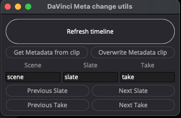

# DaVinciResolve-Adding_Scene_Slate_Take_to_Clip_Metadata

# Description
A small window for quickly changing the Scene and Take in Clip Metadata from the active Timeline clip in Editor or Color mode.\
Require DaVinci Resolve 17.4.x

